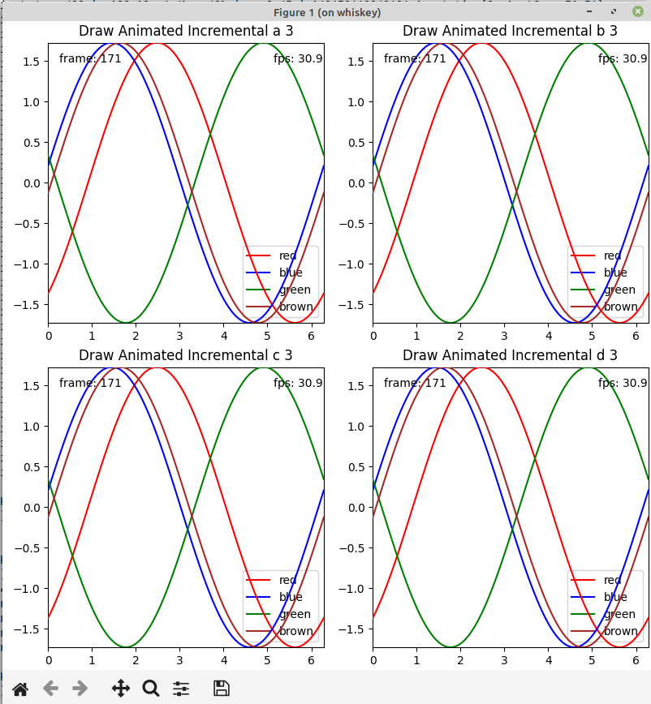

# Matplotlib - Draw Animated with Incremental Blitting
# Tue Nov 28 08:20:24 AM PST 2023


Matplotlib supports *blitting* to make animated plots update faster. 
But there are limitations to the default approach.

If your chart has fixed axis limits and you only animate the actual data the
default implementation works well. Most data elements (Line2D, etc) are reasonably fast
to render.

If you chart needs to have dynamic axis limits you then need to animate the appropriate
X and/or Y Axis and performance drops significantly. Rendering the ticks and labels
is by comparison very expensive.

This project shows how to use two *incremental blitting* approachs. We assume that
the chart data updates frequently, with periodic updates to the axes, legends and 
title. The static data only needs to be redrawn when changed, the dynamic data
is updated continuously.

The second problem with Matplotlib is the latency of drawing complex plots. If
the time used for drawing exceeds about 100ms that stalls the GUI event processing
and makes the use of the surrounding program difficult as interactions with the 
GUI are slow or delayed.

This projects uses a second *incremental* approach to rendering by limiting the 
time spent drawing to about 10ms before allowing the GUI to process events.

## Sample Code

The sample code included animates a 2x2 mosaic plot each containing four lines and two
text annotations and a title. The ylimits are periodically changed so that the YAxis ticks
and labels need to be redrawn (i.e. they need to be animiated not static.)

With the default approach the plot updates at less than 10fps. With the incremental
approach we can see about 30fps (Linux).




## Incremental Drawing of Static versus Dynamic Artists

The approach taken is to look at the artists in the figure and separate into two lists:

- static - XAxis, YAxis, Legends, Spines, title, _left_title, _right_title
- dynamic - everything else

The algorithm for drawing is:

1. save a copy of the non-animated background if not already done or restore the non-animated background 
2. draw the static artists and save or restore the static background 
3. draw the dynamic artists and blit

## Incremental Drawing for Latency

The draw_animated() function is called to do the drawing. It is designed to be
called in a loop and it will only do a small amount of work for each call. 

The function returns a tuple (msg, times).

- msg - what was just done OR None if finished blitting
- times - for artists drawn contains the average draw time and number of times drawn

The caller can arrange to call draw_animated() as many times as required with
GUI processing allowed when enough time has elapsed:

```
    # call draw_animated until msg is None, 
    # sleep to all GUI when elapsed time exceeds 10ms
    while True:
        msg, draw_time = draw_animated(fig, flush_events=True)
        if msg is None:
            break
        if draw_time is None:
            continue
        elapsed += draw_time[0]
        if elapsed < 0.01:
            continue
        elapsed = 0
        sleep(.0001)

```


## Sample Times

The sample program dumps the average time and number of times for rendering each child
axes in the figure, sorted by the average time for rendering.

We can see that the most expensive artists are the XAxis, YAxis and Legends. These
range from 6 to 10 milliseconds for drawing. But the number of times these are drawn 
is much less than the dynamic data.

By comparison all of the dynamic artists are about 1 millisecond or less. 


```
 Count|   Total(ms)         | Avg(ms) | Artist
    5 |   38.49  1.0%    1% |    7.70 | 140673392785776 XAxis(56.264222222222216,427.88922222222226)
    5 |   38.42  1.0%    2% |    7.68 | 140673333479120 XAxis(456.26422222222214,427.88922222222226)
    5 |   38.23  1.0%    3% |    7.65 | 140673333199344 YAxis(56.264222222222216,427.88922222222226)
    5 |   37.81  1.0%    4% |    7.56 | 140673334146336 Legend
    5 |   35.99  0.9%    5% |    7.20 | 140673226497456 Legend
    5 |   35.96  0.9%    6% |    7.19 | 140673333711856 XAxis(56.264222222222216,27.889222222222227)
    5 |   35.44  0.9%    7% |    7.09 | 140673333928496 XAxis(456.26422222222214,27.889222222222227)
    5 |   35.39  0.9%    7% |    7.08 | 140673226654240 Legend
    5 |   35.16  0.9%    8% |    7.03 | 140673226664368 Legend
    5 |   32.69  0.8%    9% |    6.54 | 140673333481184 YAxis(456.26422222222214,427.88922222222226)
    5 |   32.36  0.8%   10% |    6.47 | 140673333930272 YAxis(456.26422222222214,27.889222222222227)
    5 |   31.71  0.8%   11% |    6.34 | 140673333713920 YAxis(56.264222222222216,27.889222222222227)
    5 |    5.85  0.1%   11% |    1.17 | 140673333207552 Text(0.5, 1.0, 'Draw Animated Incremental a 5')
    5 |    5.56  0.1%   11% |    1.11 | 140673333489488 Text(0.5, 1.0, 'Draw Animated Incremental b 5')
    5 |    5.52  0.1%   11% |    1.10 | 140673334134384 Text(0.5, 1.0, 'Draw Animated Incremental d 5')
    5 |    5.48  0.1%   11% |    1.10 | 140673333715840 Text(0.5, 1.0, 'Draw Animated Incremental c 5')
  400 |  347.82  8.8%   20% |    0.87 | 140673333207840 Annotation(0, 1, 'frame: 399')
  400 |  201.54  5.1%   25% |    0.50 | 140673333488144 Annotation(0, 1, 'frame: 399')
  400 |  198.71  5.0%   30% |    0.50 | 140673334134672 Annotation(0, 1, 'frame: 399')
  400 |  198.24  5.0%   35% |    0.50 | 140673226503024 Annotation(0, 1, 'frame: 399')
  400 |  188.18  4.8%   40% |    0.47 | 140673334145952 Annotation(0, 1, 'fps: 31.7')
  400 |  186.80  4.7%   45% |    0.47 | 140673334143840 Line2D(red)
  400 |  175.82  4.5%   49% |    0.44 | 140673226654000 Annotation(0, 1, 'fps: 31.7')
  400 |  175.17  4.4%   54% |    0.44 | 140673226497216 Annotation(0, 1, 'fps: 31.7')
  400 |  174.76  4.4%   58% |    0.44 | 140673226664128 Annotation(0, 1, 'fps: 31.7')
    5 |    1.93  0.0%   58% |    0.39 | 140673392785872 Spine
  400 |  125.32  3.2%   61% |    0.31 | 140673226494816 Line2D(red)
  400 |  124.27  3.1%   65% |    0.31 | 140673226660624 Line2D(red)
  400 |  122.08  3.1%   68% |    0.31 | 140673226504656 Line2D(red)
  400 |  112.09  2.8%   71% |    0.28 | 140673226495488 Line2D(blue)
  400 |  110.91  2.8%   73% |    0.28 | 140673226662400 Line2D(blue)
  400 |  109.54  2.8%   76% |    0.27 | 140673226505328 Line2D(blue)
  400 |  107.25  2.7%   79% |    0.27 | 140673226496160 Line2D(green)
  400 |  106.40  2.7%   82% |    0.27 | 140673226663072 Line2D(green)
  400 |  106.13  2.7%   84% |    0.27 | 140673334144512 Line2D(blue)
  400 |  105.18  2.7%   87% |    0.26 | 140673226506000 Line2D(green)
  400 |  102.99  2.6%   89% |    0.26 | 140673226496832 Line2D(brown)
  400 |  102.56  2.6%   92% |    0.26 | 140673226663744 Line2D(brown)
  400 |  102.37  2.6%   95% |    0.26 | 140673333707440 Line2D(brown)
  400 |  101.70  2.6%   97% |    0.25 | 140673334144896 Line2D(green)
  400 |   99.64  2.5%  100% |    0.25 | 140673334145568 Line2D(brown)
    5 |    1.07  0.0%  100% |    0.21 | 140673333479072 Spine
    5 |    1.02  0.0%  100% |    0.20 | 140673333711808 Spine
    5 |    1.00  0.0%  100% |    0.20 | 140673333928448 Spine
    5 |    0.59  0.0%  100% |    0.12 | 140673392786352 Spine
    5 |    0.57  0.0%  100% |    0.11 | 140673392786112 Spine
    5 |    0.50  0.0%  100% |    0.10 | 140673333479552 Spine
    5 |    0.50  0.0%  100% |    0.10 | 140673333928928 Spine
    5 |    0.49  0.0%  100% |    0.10 | 140673333712288 Spine
    5 |    0.48  0.0%  100% |    0.10 | 140673333712048 Spine
    5 |    0.48  0.0%  100% |    0.10 | 140673333479312 Spine
    5 |    0.48  0.0%  100% |    0.10 | 140673333928688 Spine
    5 |    0.44  0.0%  100% |    0.09 | 140673392786592 Spine
    5 |    0.38  0.0%  100% |    0.08 | 140673333712528 Spine
    5 |    0.38  0.0%  100% |    0.08 | 140673333479792 Spine
    5 |    0.37  0.0%  100% |    0.07 | 140673333929024 Spine

```


